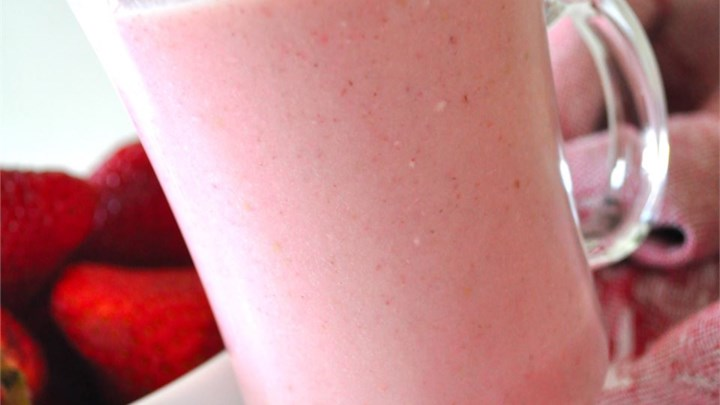

# Strawberyy Smoothie :)
 
I enjoy drinking nutritious smoothies from time to time. My favorite being Strawberry flavored.

- **Prep:** 5 Minutes
- **Ready In:** 6 Minutes

# Ingredients :)

- 8 Strawberries, hulled
- 1/2 Cup of skim milk
- 3 Tablespoons of white sugar
- 6 Ice cubes, crushed
- 2 Teaspoons of vanilla extract
- 1/2 Cup plain yogurt

# Super Difficult Directions :)

1. In a blender combine strawberries, milk, yogurt, sugar and vanilla. Toss in the ice. Blend until smooth and creamy. Pour into glasses and serve.

2. Enjoy phenomenal tasting smoothie.

